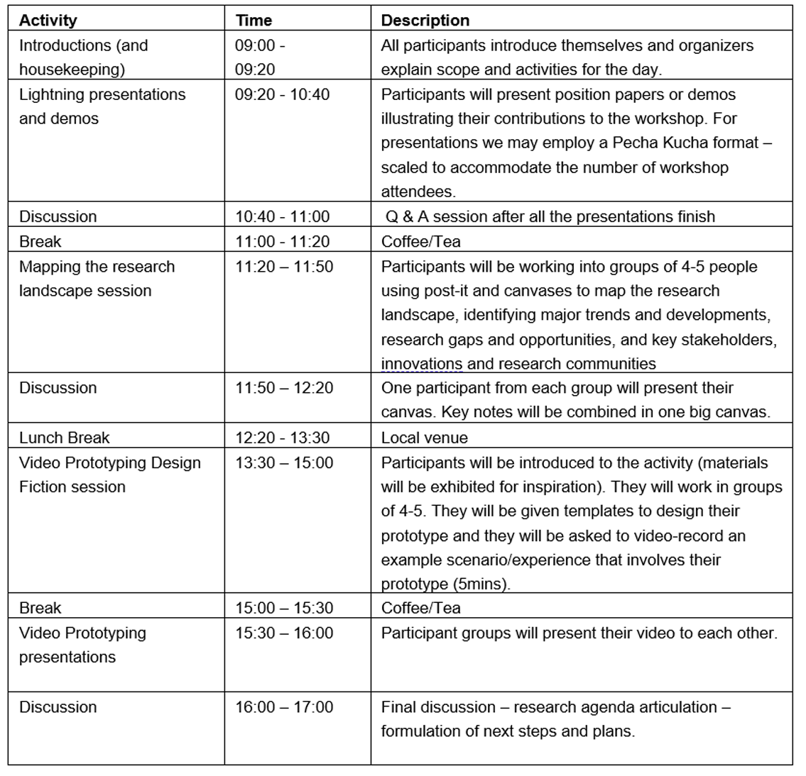
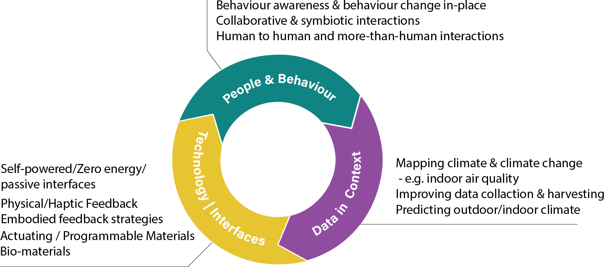

## Workshop Call

We invite submissions from HCI researchers, architects, designers, engineers, computer scientists and others to participate in a one-day workshop on **Human-Building-Interaction (HBI) and Design for Climate Change** at DIS 2024, at IT University, Copenhagen-DK, on Monday the 1st of July 2024.

 
Climate change poses unique challenges for the design of human-centered smart buildings and Human Building Interaction (HBI) research. Harvesting the potentials of vast amounts of environmental and personal data accumulated in contemporary smart buildings, and advances in programmable, actuating (bio)materials (such as CO2 harvesting), new design opportunities arise for novel data interactions that address climate, health & wellbeing and behavior in the built environment. Relevant research includes physical, biomaterial and tangible feedback for climate awareness – including air quality awareness-zero & passive energy, self-powered and compostable interfaces; and bio-design for wellbeing in-place.

 

Building upon past research, this workshop invites you to rethink our relationships with data in buildings within the context of climate change; contributing towards shaping an HCI/design agenda for more-than-human, symbiotic relationships with the built environment.

Download the [Workshop Call here](https://drive.google.com/file/d/1VwO1mGHS-TVBwpnyDKr5ej5XfO56oHI7/view?usp=sharing)

## Workshop Activities and Schedule

The workshop will explore different contexts, study methods, designs and technologies broadly associated with Human-Building-Interaction and climate change. Invited participants will present their work during a lightning talks and demos session, followed by a “mapping the research landscape” exercise. Participants will collaboratively video prototype design fictions for new experiences around climate, interfaces and data interactions in buildings, and engage in design crit and discussion around the prototypes and key topics raised, as a contribution to workshop outcomes. The emerging design agenda developed in this workshop will inform a call for future publications.

**Workshop Intended Outcomes**

This workshop will map the research landscape and frame a design research agenda for HBI and design in relation to climate change; bringing emerging practices amongst different disciplines and research fields together. Intended outcomes of this workshop include:

- Framing a new design agenda for HBI research within climate change.
- Sharing theories, methodologies, practices, and tools for supporting this design agenda.
- Discussing and critically reflecting on technologies and case studies with the view of supporting this design agenda.
- Fostering future collaborations on the topic of HBI & design for climate change.

**Workshop Themes and Topics**

Our workshop will discuss emerging design research practices to frame a design agenda that is contextualized within climate change, and addresses feedback, data, materiality and human behavior within the built environment. Our workshop’s specific areas of interest are categorized under the following **Themes & Topics of Interest**. Participants are invited to submit proposals that address (but are not limited to) these themes and topics.

**Theme A: People & Behavior in buildings**

- Climate-sensitive Behavior awareness & behavior change in place.
- Collaborative & symbiotic interactions in buildings
- Human-to-human and more-than-human interactions
- Climate awareness and health & well-being
- Towards net-zero: framing human-building interactions under net-zero and carbon-offset strategies.

**Theme B: Climate Data & Context**

- Mapping aspects of climate & climate change in buildings – e.g. complexity of indoor air quality
- Methods for mapping experiences relevant with climate change and data in the buildings: quantitative, qualitative, and mixed-methods approaches; process-oriented methods; research through design.
- Data collection & data harvesting – new approaches to sensing
- Human-AI interaction and climate prediction
- Ethics of climate data; sensing and privacy.
- Context (i.e. home, shared, public building spaces), data practices and data representation

**Theme C: Design, technology and Interfaces**

- Biomimetic & biophilic interfaces
- Self-powered / passive & zero energy interfaces
- Physical Feedback strategies – e.g. haptic, embodied etc.
- Actuating / Programmable materials
- Biomaterials & feedback
- Digital and personal fabrication

## Participate in the Workshop (deadline 27th of May)

[>>Submit your proposal here]({{ formUrl }})

**Deadline for submissions: 7th of June**

**We will review your submissions and get back to you by 7th of June.**

The workshop will be a full-day in-person event. Participants are invited to join for the whole day. Information about the Conference Venue can be found [here](https://dis.acm.org/2024/attending-dis24/).

Submissions are possible in the following formats, using ACM Conference Proceedings templates:

(1) Motivational Statement highlighting professional interest in the workshop and relevant expertise (max. 2 pages, pdf files only)
(2) Extended Abstract in the ACM Conference Proceedings Primary Article format (max. 4 pages excluding references)
(3) Pictorial format (max. 4 pages)

Submissions should address subjects related to the Themes and Topics above, including but not limited to: **People and Behaviour in the Buildings (Under climate change); Climate Data & Context; Design, Technology and Interfaces**.

Please indicate whether you do or do not wish for your submission to be published on the workshop website.

At least one author of each accepted paper must attend the workshop. Participants will be selected based on their prior experience, expressed interest in the workshop and the quality of their submissions. We will focus on recruiting from a diverse group of participants.

Depending on the number and quality of submissions we intend to invite the authors of Extended Abstracts to develop them either into a book chapter or a journal special issue manuscript.

If you have any queries, please contact:

**Lenia Margariti** [lenia.margariti@newcastle.ac.uk](mailto:lenia.margariti@newcastle.ac.uk).

## Workshop Chairs



 
